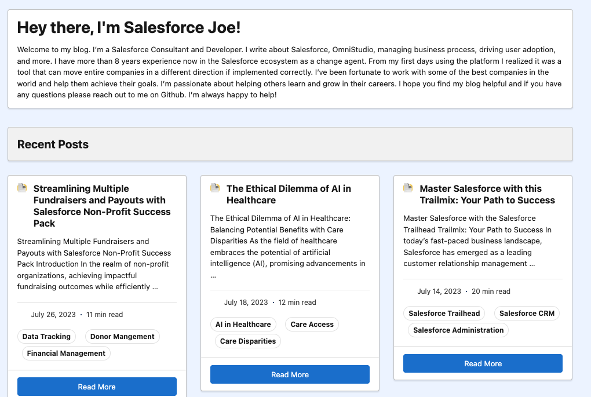
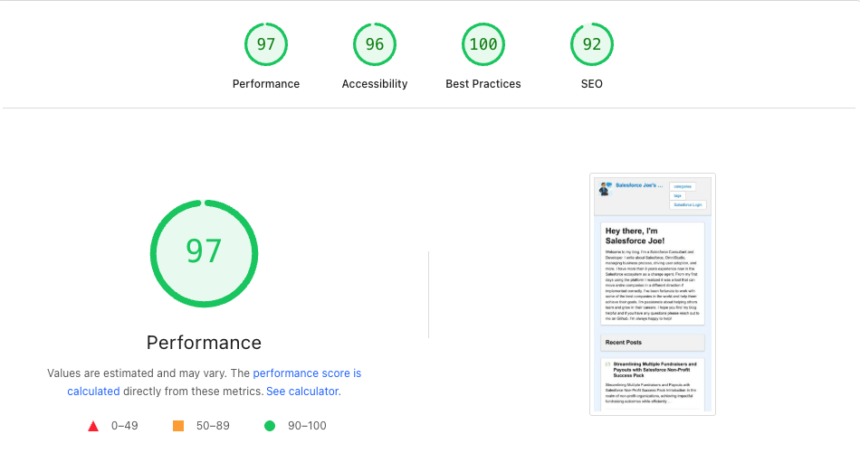

# Salesforce Lighting Hugo Theme

A Hugo theme based on the [Salesforce Lightning Design System](https://www.lightningdesignsystem.com/).



## Performance

This theme is optimized for performance and scores **97 out of 100** on [Google PageSpeed Insights](https://pagespeed.web.dev/).



## Features

- 🎨 Built with Salesforce Lightning Design System (SLDS) components
- 📱 Fully responsive design that works on all devices
- 🎯 Clean, modern Salesforce-inspired UI
- 📝 Support for blog posts, categories, and tags
- ⚙️ Highly customizable through Hugo configuration
- 🚀 Fast and lightweight
- ♿ Accessible and semantic HTML

## Installation

### As a Git Submodule (Recommended)

```bash
cd your-hugo-site
git submodule add https://github.com/JHenzi/salesforce-lightning-hugo-theme.git themes/salesforce-lighting
```

### As a Clone

```bash
cd your-hugo-site/themes
git clone https://github.com/JHenzi/salesforce-lightning-hugo-theme.git salesforce-lighting
```

### As a Hugo Module

Note: This requires the theme to be set up as a Hugo module. For now, use Git submodule or clone method.

```bash
# If configured as a module:
hugo mod get github.com/JHenzi/salesforce-lightning-hugo-theme
```

Then set the theme in your `config.yml`:

```yaml
theme: salesforce-lighting
```

## Configuration

The theme supports all standard Hugo configuration options. Key parameters include:

- `mainSections`: List of content sections to display on the homepage (default: `["posts"]`)
- `ShowReadingTime`: Show reading time for posts
- `ShowShareButtons`: Show social sharing buttons
- `ShowPostNavLinks`: Show previous/next post navigation
- `homeInfoParams`: Homepage introduction content

## SLDS Integration

The theme uses the Salesforce Lightning Design System via CDN. The CSS is automatically loaded from:

```
https://cdn.jsdelivr.net/npm/@salesforce-ux/design-system@2.20.0/assets/styles/salesforce-lightning-design-system.min.css
```

## Customization

### Custom CSS

Add your custom styles to `themes/salesforce-lighting/static/css/custom.css`

### Custom JavaScript

Add your custom scripts to `themes/salesforce-lighting/static/js/custom.js`

### Icons

The theme references SLDS icons. For production use, you may want to:
1. Download the SLDS icon sprite files
2. Place them in `themes/salesforce-lighting/static/assets/icons/`
3. Update icon references in templates to use local paths

## Layouts

- `layouts/_default/baseof.html` - Base template
- `layouts/_default/index.html` - Homepage
- `layouts/_default/list.html` - List pages (categories, tags, etc.)
- `layouts/_default/single.html` - Single post/page
- `layouts/404.html` - 404 error page

## Partials

- `partials/head.html` - HTML head section
- `partials/header.html` - Site header/navigation
- `partials/footer.html` - Site footer
- `partials/post-card.html` - Post card component
- `partials/scripts.html` - JavaScript includes

## Contributing

Contributions are welcome! Please feel free to submit a Pull Request.

1. Fork the repository
2. Create your feature branch (`git checkout -b feature/AmazingFeature`)
3. Commit your changes (`git commit -m 'Add some AmazingFeature'`)
4. Push to the branch (`git push origin feature/AmazingFeature`)
5. Open a Pull Request

## Issues

If you encounter any problems or have suggestions, please [open an issue](https://github.com/JHenzi/salesforce-lightning-hugo-theme/issues).

## License

This project is open source and available under the [MIT License](LICENSE).

## Credits

- Built with [Hugo](https://gohugo.io/)
- Styled with [Salesforce Lightning Design System](https://www.lightningdesignsystem.com/)
- Icons from [Salesforce Lightning Design System Icons](https://www.lightningdesignsystem.com/icons/)

## Author

**Joseph Henzi**
- GitHub: [@JHenzi](https://github.com/JHenzi)
- Website: [Salesforce Joe](https://salesforcejoe.com)

## Acknowledgments

- Thanks to Salesforce for creating the Lightning Design System
- Inspired by the Hugo community and their amazing themes

